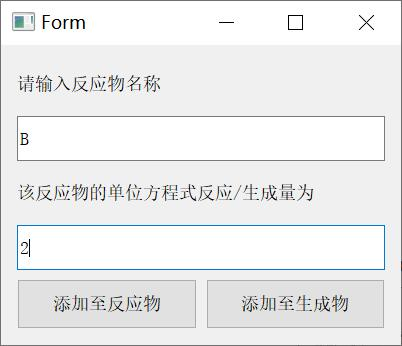
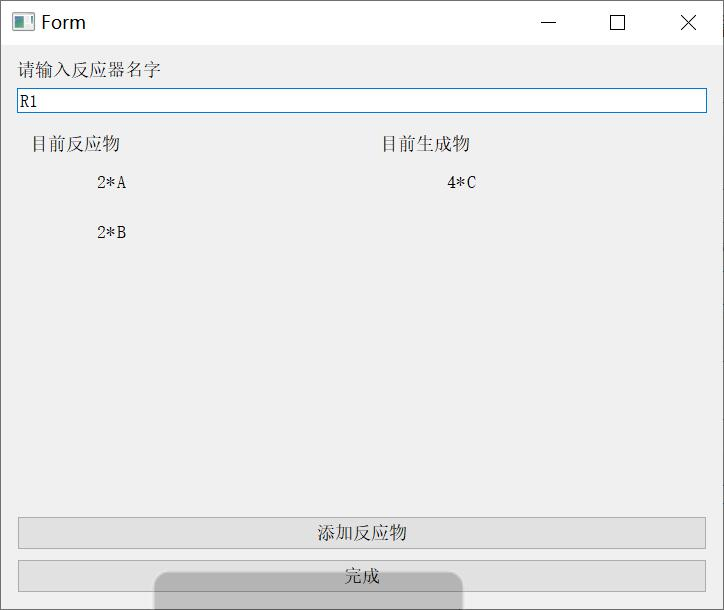
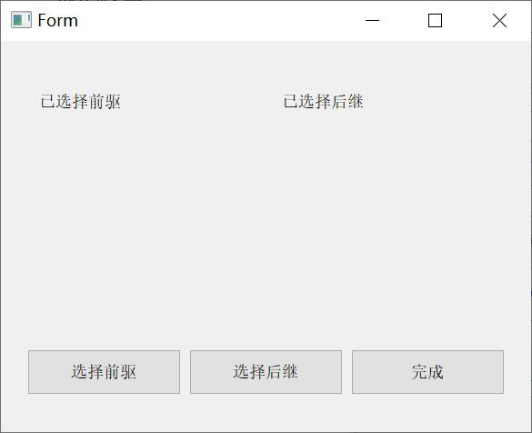
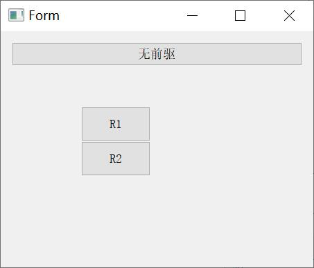
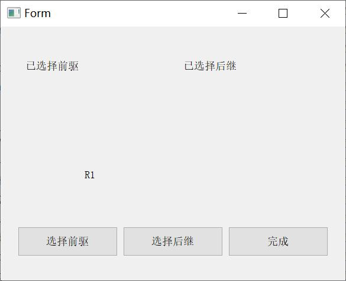
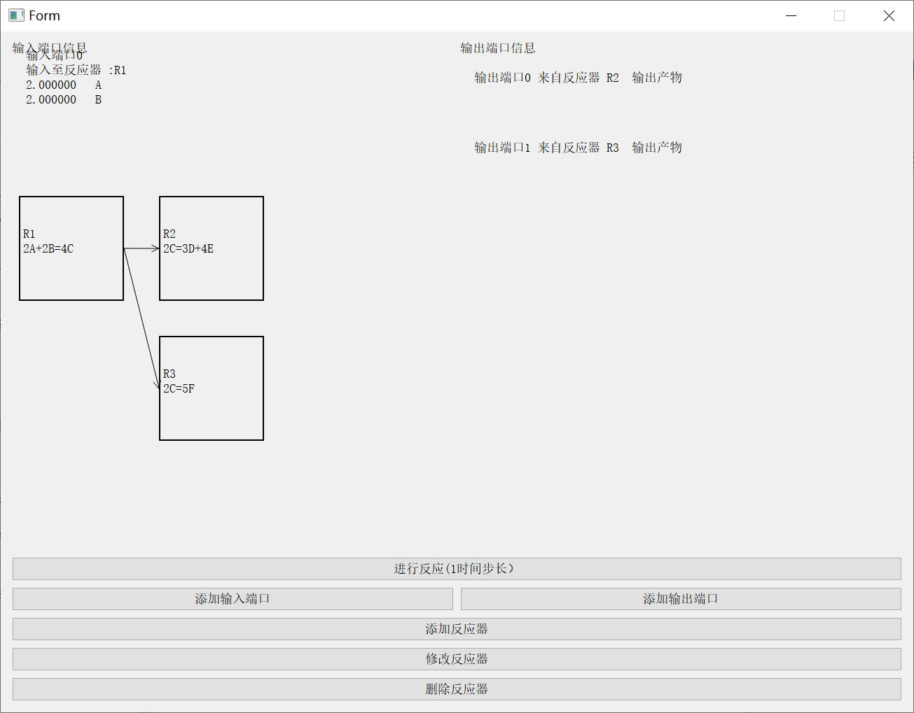
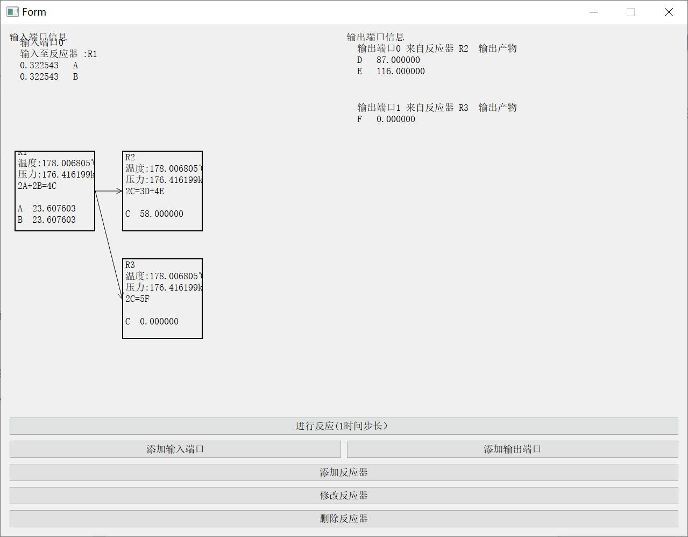

# 化学反应器

Code为QT工程文件，在QT Creator中打开Reactor.pro即可打开QT工程。

exe下为可执行文件

# 使用流程

### 1.添加反应器

反应器负责进行一个化学方程式的反应，在添加反应器界面可以输入每个反应物和生成物的名字与其在方程式中对应的权重。

完成后需要为反应器选择前驱反应器或后继反应器来实现反应器之间的连接，若为初次创建反应器，则不需选择，只单机“完成”即可。

后续添加的反应器需要为其选择前驱后继。

### 2.添加输入端口

输入端口为整个反应流程添加输入反应物,在添加页面输入每步长添加的反应物名称与量，并选择后继反应器作为输入端口的输出，以为整个反应流程补充原料。

### 3.添加输出端口

输出端口保存整个流程最终的产物，末端反应器作为输出端口，在添加输出端口时，只需要选择前驱（输出端口的输入），即整个流程最终的输出

### 4.进行反应

实例流程：连接完成后如图所示。

之后单机进行反应即可进行一时间步长的反应。

